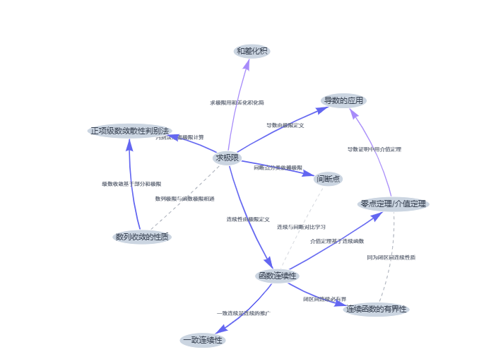

<p align="center">
  
  
  
</p>

<h1 align="center">Reflection Journal</h1>
<p align="center"><strong>AI 驱动的个人知识复习系统</strong> — 让每一道错题都产生复利</p>

<p align="center">
  <a href="https://zzh-0207.github.io/Reflection-Journal/">在线使用</a> ·
  <a href="#本地-ai-版本">本地 AI 版本</a> ·
  <a href="#功能">功能</a> ·
  <a href="#技术架构">架构</a>
</p>

---

## 这是什么

一个**自带 AI 知识图谱**的间隔重复复习工具。记录你做错的题目，SM-2 算法自动安排最佳复习时机，AI 分析所有知识点的内在关联，生成交互式知识图谱——帮你看清自己的知识结构。

<p align="center"></p>

## AI 知识图谱

<p align="center"><em>点击 AI 分析按钮，DeepSeek V4 Pro 自动发现知识点之间的 5 种关联关系</em></p>

| 关联类型 | 示例 |
|---|---|
| **前置依赖** `极限 → 导数` | 必须先掌握 A 才能理解 B |
| **平行关联** `洛必达 ↹ 泰勒` | 同领域的不同工具，常一起出现 |
| **包含关系** `定积分 ⊃ 牛莱公式` | A 是 B 的子知识点 |
| **应用关联** `特征值 → PCA` | A 的理论被应用于 B |
| **对比关联** `条件概率 ↹ 贝叶斯` | 容易混淆，需要对比学习 |

> 图谱使用 vis-network 力导向布局渲染，节点大小反映题目数量，颜色深浅反映掌握程度，所有分析结果缓存在本地 IndexedDB。

## 功能

<table>
<tr><td width="50%">

### Review 智能复习
- 每日定额 22 道，轻量化任务
- 优先级排序：逾期久 + 薄弱点优先
- 4 级反馈（Again / Hard / Good / Easy）
- 专注模式：先看题再看答案
- 一键加练，灵活调整

### Capture 快速录入
- Markdown + LaTeX 公式渲染
- 原解照片（Base64 本地存储）
- 知识点标签自动补全
- 自定义录入原因

</td><td width="50%">

### Insights 数据面板
- 科目分布 · 录入原因 · 30 天趋势
- 薄弱知识点自动识别
- 存储空间实时监控
- 深色模式自适应

### Browse 题目管理
- 全文搜索 · 多维度筛选
- 题目编辑 · 批量管理
- 数据导入/导出（JSON）

</td></tr>
</table>

## 本地 AI 版本

GitHub Pages 上的在线版包含除 AI 分析外的全部功能。AI 知识图谱需要在本地运行（绕过浏览器 CORS 限制）：

```bash
git clone https://github.com/ZZH-0207/Reflection-Journal.git
cd Reflection-Journal
git checkout ai-local
node server.js
```

浏览器打开 `http://localhost:3000`，在 Graph 面板中输入你的 [DeepSeek API Key](https://platform.deepseek.com/api_keys)，点击 AI 分析即可。

> **为什么这样设计？** LLM API 不允许浏览器直接调用。本地 `server.js` 作为代理中转请求，API Key 只保存在你自己的浏览器中。

## 技术架构

```
┌─ 前端 ─────────────────────────────────────┐
│  index.html (纯 HTML + JS, ~2500 行)         │
│                                              │
│  ┌──────────┐ ┌──────────┐ ┌─────────────┐  │
│  │  SM-2    │ │  AI 知识  │ │  数据可视化  │  │
│  │  复习引擎 │ │  图谱分析 │ │  Chart.js   │  │
│  └──────────┘ └──────────┘ └─────────────┘  │
│         │            │             │         │
│  ┌──────┴────────────┴─────────────┴──────┐  │
│  │         IndexedDB 持久化存储            │  │
│  └────────────────────────────────────────┘  │
└──────────────────┬───────────────────────────┘
                   │
         ┌─────────┴─────────┐
         │   GitHub Pages    │  在线版（Review / Capture / Insights / Browse）
         │   localhost:3000  │  AI 版（以上全部 + DeepSeek V4 Pro 知识图谱）
         └───────────────────┘
```

## 技术选型

| 层面 | 选型 | 考量 |
|---|---|---|
| AI 模型 | DeepSeek V4 Pro | 中文理解力强，支持 JSON Mode，成本极低 |
| 复习算法 | SM-2 | 经典间隔重复算法，Anki 同款 |
| 可视化 | Chart.js · vis-network | 统计图表 + 力导向知识图谱 |
| 渲染 | KaTeX · Marked.js | 数学公式 + Markdown |
| 存储 | IndexedDB | 无容量限制，异步不阻塞 UI |
| 样式 | Tailwind CSS v3 | CDN 引入，零构建 |

## 项目故事

做这个项目的起因很简单：刷题时发现**一周前认真搞懂的题，再遇到还是不会**。艾宾浩斯遗忘曲线不是理论，是每天都在发生的事。

市面上的间隔重复工具（Anki 等）偏向记忆卡片，填入数学公式很痛苦，更谈不上分析知识结构。于是自己动手写了一个——

1. **SM-2 算法驱动复习**：每道题根据自己的答题反馈自动计算下次复习时间，不再靠感觉安排
2. **IndexedDB 替换 localStorage**：原解截图动辄几百 KB，5MB 限制根本不够，迁移到 IndexedDB 后容量由磁盘决定
3. **AI 知识图谱**：知识点越积越多后，手动梳理它们的关系变得不可能。借助 DeepSeek V4 Pro，一键分析出前置依赖、平行关联、包含关系等，用 vis-network 渲染成交互式图谱——**第一次直观地"看见"了自己的知识结构**

这是一个每天都在迭代的项目，从最初的 localStorage 单页，到现在 AI 驱动的知识管理系统，每一步都是为了解决自己真实遇到的问题。

## License

MIT
